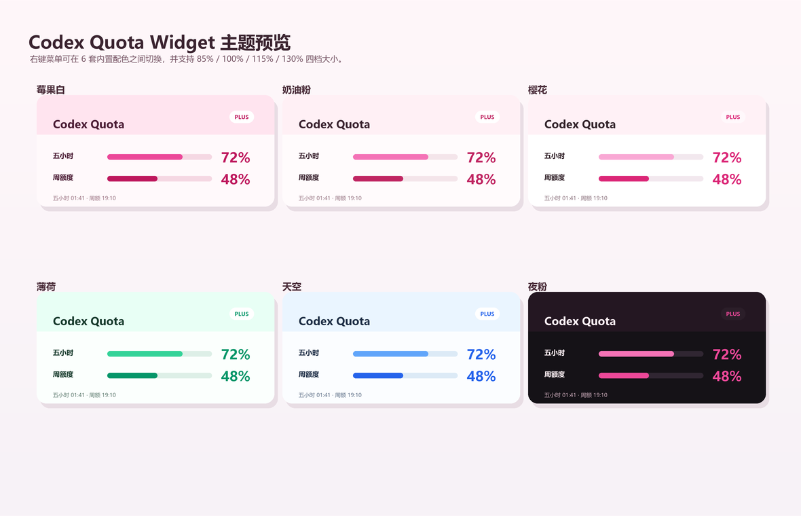

# Codex Quota Widget

粉白配色的 Windows 桌面小窗，用来显示 Codex 本地日志里的最近一次额度快照。



## 功能

- 显示五小时额度、周额度和对应刷新时间。
- 每 30 秒重新读取一次 Codex 本地日志。
- 右键菜单支持重新读取、切换配色、切换大小、复制摘要、切换置顶和退出。
- 可拖动位置，位置保存到 `D:\Codex\quota_widget\settings.json`。
- 可安装 watcher：Codex Desktop 打开时自动启动小窗，Codex Desktop 关闭时自动关闭小窗。
- 右键菜单可切换内置配色：莓果白、奶油粉、樱花、薄荷、天空、夜粉。

## 使用

### 普通用户

下载 `CodexQuotaWidget.exe` 后双击运行即可。

安装“跟随 Codex 自动开关”：

```powershell
powershell -ExecutionPolicy Bypass -File .\install_quota_autostart.ps1
```

安装后：

- 打开 Codex Desktop 时，小窗会自动打开。
- 关闭 Codex Desktop 时，小窗会自动关闭。
- Windows 登录后会自动启动 watcher，但只有 Codex Desktop 运行时才显示小窗。

卸载自动启动：

```powershell
powershell -ExecutionPolicy Bypass -File .\uninstall_quota_autostart.ps1
```

### 开发者

直接用 Python 启动小窗：

```powershell
powershell -ExecutionPolicy Bypass -File .\run_quota_widget.ps1
```

## 说明

这个小窗读取的是 Codex 本地会话日志中的 `rate_limits` 快照，不会主动请求官方服务器，也不会保存账号密码。

右键菜单里的“重新读取”只是重新读取本地日志；如果 Codex 还没有写入新的额度快照，显示值不会变化。

## 配色

内置配色：

- 莓果白：默认主题，粉白顶栏，适合长期放桌面。
- 奶油粉：更柔和，偏暖。
- 樱花：更轻、更白。
- 薄荷：绿色低焦虑配色。
- 天空：蓝白清爽配色。
- 夜粉：深色桌面更协调。

右键小窗，点击 `配色: ...` 即可循环切换，选择会自动保存。

## 大小

右键小窗，点击 `大小: ...` 可在 85%、100%、115%、130% 四档之间循环切换，选择会自动保存。

## 打包

开发者可以用 PyInstaller 打包：

```powershell
pyinstaller --noconsole --onefile --name CodexQuotaWidget codex_quota_widget.py
```
